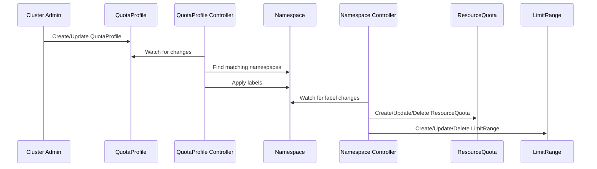
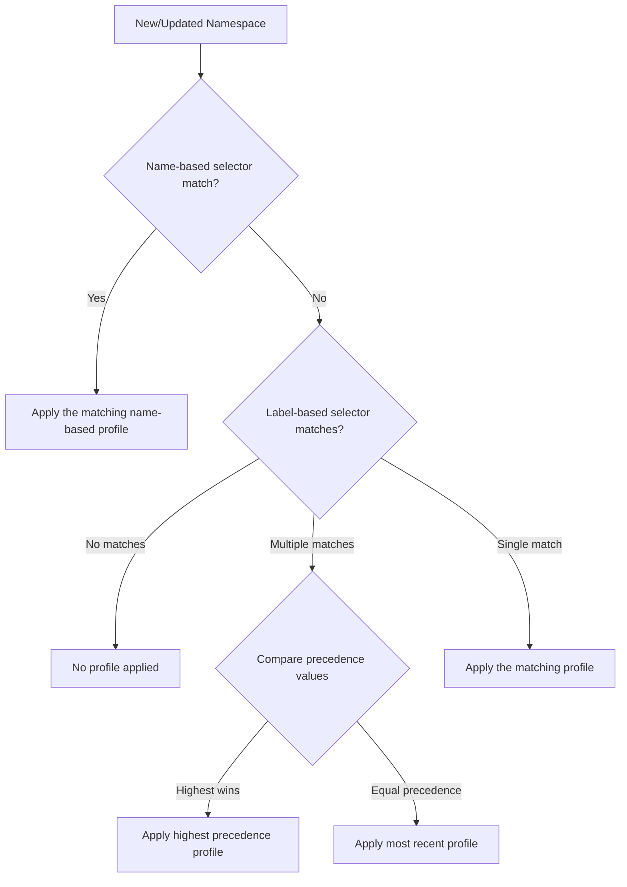
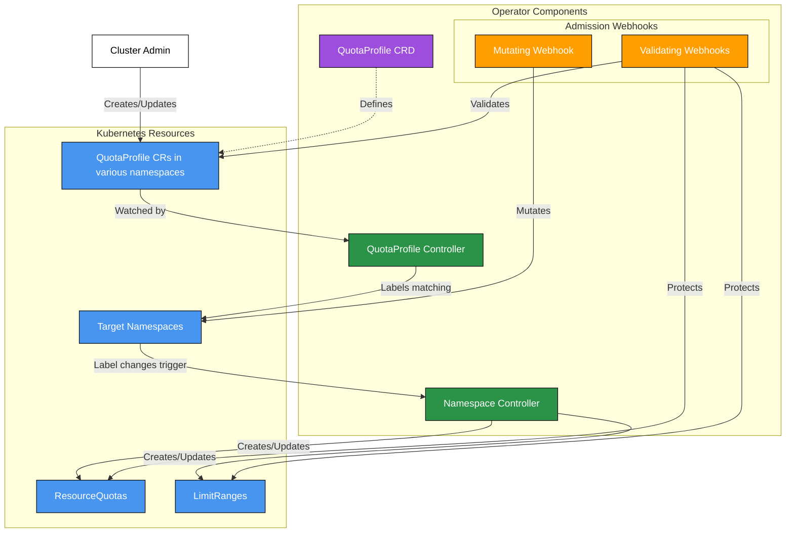

# Namespace Quota Operator

[](https://opensource.org/licenses/Apache-2.0)

The Namespace Quota Operator is a Kubernetes operator that provides dynamic and flexible management of resource quotas and limit ranges across namespaces. It allows cluster administrators to define quota profiles that can be automatically applied to namespaces based on names or labels.

## Table of Contents

- [Overview](#overview)
- [Description](#description)
  - [Quota Assignment Workflow](#quota-assignment-workflow)
- [Custom Resource Definition (CRD)](#custom-resource-definition-crd)
  - [QuotaProfile](#quotaprofile)
  - [Precedence Resolution](#precedence-resolution)
- [Components](#components)
  - [Architecture](#architecture)
  - [Controllers](#controllers)
  - [Webhooks](#webhooks)
- [Getting Started](#getting-started)
  - [Prerequisites](#prerequisites)
  - [To Deploy on the cluster](#to-deploy-on-the-cluster)
  - [To Uninstall](#to-uninstall)
- [Project Distribution](#project-distribution)
  - [By providing a bundle with all YAML files](#by-providing-a-bundle-with-all-yaml-files)
  - [By providing a Helm Chart](#by-providing-a-helm-chart)
- [License](#license)

## Overview

The operator introduces a custom resource called `QuotaProfile` that enables you to:

- Define multiple ResourceQuota and LimitRange specifications in a single profile
- Target namespaces using either name-based or label-based selector
- Implement precedence-based quota assignment when multiple profiles match a namespace
- Automatically manage the lifecycle of ResourceQuota and LimitRange resources

## Description

The Namespace Quota Operator simplifies the management of resource quotas and limit ranges in Kubernetes clusters by providing a centralized and automated approach. Instead of manually creating and managing individual ResourceQuota and LimitRange resources for each namespace, administrators can define reusable QuotaProfiles that are automatically applied based on namespace names or labels.

Key benefits include:

- **Centralized Management**: Define quota policies once and apply them across multiple namespaces
- **Automated Enforcement**: Automatically create, update, and delete quota resources as namespaces are created or modified
- **Flexible Targeting**: Use either namespace names or labels to determine which quotas apply
- **Precedence-based Resolution**: Clear rules for handling multiple matching profiles through name-based precedence and configurable priority levels
- **Protected Resources**: Validation webhooks prevent manual modifications to operator-managed resources
- **Automatic Cleanup**: Finalizers ensure proper cleanup of quota-related resources and labels

### Quota Assignment Workflow



## Custom Resource Definition (CRD)

### QuotaProfile

The `QuotaProfile` CRD allows you to define resource quotas and limit ranges that should be applied to matching namespaces.

```yaml
apiVersion: quota.dev.operator/v1alpha1
kind: QuotaProfile
metadata:
  name: example-profile
spec:
  # Only one of matchLabels or matchName can be specified
  namespaceSelector:
    matchLabels:
      environment: dev
    # OR
    matchName: "namespace-name"

  # Higher precedence values take priority when multiple profiles match
  precedence: 10

  # List of ResourceQuota specifications
  resourceQuotaSpecs:
  - hard:
      requests.cpu: "1"
      requests.memory: "1Gi"
      limits.cpu: "2"
      limits.memory: "2Gi"

  # List of LimitRange specifications
  limitRangeSpecs:
  - limits:
    - type: Container
      default:
        cpu: 500m
      defaultRequest:
        cpu: 500m
      max:
        cpu: "1"
      min:
        cpu: 100m
```

**Key Features:**

- Only one selector type (name or labels) can be used per profile
- Name-based selectors have the highest precedence
- For label-based selectors, the `precedence` field determines priority
- If profiles have the same precedence, the most recently created profile takes effect

#### Precedence Resolution



## Components

### Architecture



### Controllers

#### QuotaProfile Controller

- Monitors namespaces and matches them against QuotaProfiles
- Assigns namespace labels for tracking:
  - `quota.dev.operator/profile`: `<qp-namespace>:<qp-name>`
  - `quota.dev.operator/profile-last-update-timestamp`: RFC3339 timestamp (`:` replaced with `-`)
- Implements *finalizers* to clean up labels from namespaces when profiles are deleted

#### Namespace Controller

- Watches for namespace label changes
- Creates, updates, or deletes ResourceQuota and LimitRange resources based on the assigned QuotaProfile

### Webhooks

The operator implements four webhooks to ensure proper resource management:

#### QuotaProfile Validating Webhook
   - Ensures only one selector type is specified (name or labels)
   - Prevents conflicts with existing QuotaProfiles using the same selector

#### Namespace Mutating Webhook
   - Evaluates namespaces against all QuotaProfiles
   - Updates namespace labels when matches are found
   - Removes quota-related labels when no profiles match

#### LimitRange Validating Webhook
   - Prevents manual updates/deletions of operator-managed LimitRange resources

#### ResourceQuota Validating Webhook
   - Prevents manual updates/deletions of operator-managed ResourceQuota resources

## Getting Started

### Prerequisites

- go version v1.23.0+
- docker version 17.03+
- kubectl version v1.11.3+
- Access to a Kubernetes v1.11.3+ cluster
- cert-manager v1.0.0+ installed in the cluster (required for webhook certificates)

### To Deploy on the cluster

**Build and push your image to the location specified by `IMG`:**

```sh
make docker-build docker-push IMG=<some-registry>/namespace-quota-operator:tag
```

**NOTE:** This image ought to be published in the personal registry you specified.
And it is required to have access to pull the image from the working environment.
Make sure you have the proper permission to the registry if the above commands don't work.

**Install the CRDs into the cluster:**

```sh
make install
```

**Deploy the Manager to the cluster with the image specified by `IMG`:**

```sh
make deploy IMG=<some-registry>/namespace-quota-operator:tag
```

> **NOTE**: If you encounter RBAC errors, you may need to grant yourself cluster-admin
privileges or be logged in as admin.

**Create instances of your solution**
You can apply the samples (examples) from the config/sample:

```sh
kubectl apply -k config/samples/
```

>**NOTE**: Ensure that the samples has default values to test it out.

### To Uninstall

**Delete the instances (CRs) from the cluster:**

```sh
kubectl delete -k config/samples/
```

**Delete the APIs(CRDs) from the cluster:**

```sh
make uninstall
```

**UnDeploy the controller from the cluster:**

```sh
make undeploy
```

## Project Distribution

Following the options to release and provide this solution to the users.

### By providing a bundle with all YAML files

1. Build the installer for the image built and published in the registry:

```sh
make build-installer IMG=<some-registry>/namespace-quota-operator:tag
```

**NOTE:** The makefile target mentioned above generates an 'install.yaml'
file in the dist directory. This file contains all the resources built
with Kustomize, which are necessary to install this project without its
dependencies.

2. Using the installer

Users can just run 'kubectl apply -f <URL for YAML BUNDLE>' to install
the project, i.e.:

```sh
kubectl apply -f https://raw.githubusercontent.com/<org>/namespace-quota-operator/<tag or branch>/dist/install.yaml
```

### By providing a Helm Chart

1. Build the chart using the optional helm plugin

```sh
kubebuilder edit --plugins=helm/v1-alpha
```

2. See that a chart was generated under 'dist/chart', and users
can obtain this solution from there.

**NOTE:** If you change the project, you need to update the Helm Chart
using the same command above to sync the latest changes. Furthermore,
if you create webhooks, you need to use the above command with
the '--force' flag and manually ensure that any custom configuration
previously added to 'dist/chart/values.yaml' or 'dist/chart/manager/manager.yaml'
is manually re-applied afterwards.

**NOTE:** Run `make help` for more information on all potential `make` targets

More information can be found via the [Kubebuilder Documentation](https://book.kubebuilder.io/introduction.html)

## License

Copyright 2025.

Licensed under the Apache License, Version 2.0 (the "License");
you may not use this file except in compliance with the License.
You may obtain a copy of the License at

    http://www.apache.org/licenses/LICENSE-2.0

Unless required by applicable law or agreed to in writing, software
distributed under the License is distributed on an "AS IS" BASIS,
WITHOUT WARRANTIES OR CONDITIONS OF ANY KIND, either express or implied.
See the License for the specific language governing permissions and
limitations under the License.
